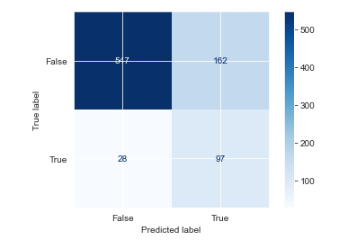
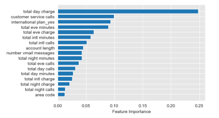
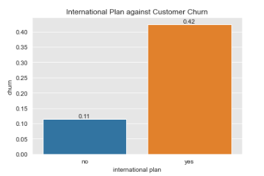
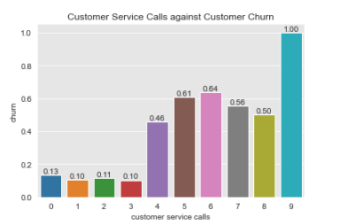
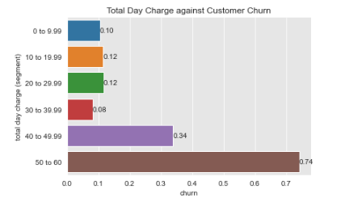

# Business Problem

SyriaTel is a telecommunications company.  The enterprise is interested in retaining more customers due to the loss of revenue.
SyriaTel wants to understand the following:

- Can customer attrition be predicted?
- Are there any client characteristics that can identify customer attrition? 

# Data Understanding

The data for examing the aforementioned problem comes from the following source: [Churn in Telecom's dataset](https://www.kaggle.com/datasets/becksddf/churn-in-telecoms-dataset).

Before beginning to identify any trends with customers that churn, I want to examine and become familiar with the dataset.  I will conduct exploratory data analysis in order to understand the dataset attributes, which includes, but not limited to the following:

1. Number of Columns
2. Number of Rows
3. Column Names
4. Format of the data in each column

**Observations | Columns**

The dataset has a total of 21 columns.  The following variables, or the four columns - *State*, *Phone Number*, *International Plan*, and *Voice Mail Plan* - are in string format.  My immediate intuition is that these values require One-Hot Encoding.

## Observations | Number of States

Based on the following code - *df['state'].nunique()* - there are a total of 51 states.  That is not true since there are 50 states in the United States of America.

However, upon reviewing the output of the following code - *df['state'].value_counts()* - I see that the District of Columbia is being counted as a state.  There are 54 observations for the District of Columbia.

## Observations | Number of Values within the *Churn* Column

Based on the following code - *df['churn'].value_counts()* - there are are more *True* observations than *False*.  There are 2,850 observations that are *False*, or 2,850 customers that did not Churn.  There are 483 observations that are *True*, or 483 customers that did churn.  There is an imbalance within the data set.    

If I proceed with using a train-test split later, an idea is to use SMOTE in order to create more *True* observations within the Training data.

## Observations | Missing Values

Based on the following code - *df.isnull().sum()* - there is no missing data in any of the 21 columns.  

Based on the following code - *df.duplicated().sum()* - there are no duplicate rows in the dataset.

I would state that the dataset is *clean* in both aspects.

# Data Preparation

Before performing any modeling, I want to prepare the dataset.  As stated prior, the dataset is *clean* in respect to missing data.  There is no missing data based on the following code - - *df.isnull().sum()*.  As a result, I do not need to consider any data cleaning strategies such as the following: 1) eliminating rows of data, 2) replacing missing values with another value such as a median, or 3) simply maintaining the missing rows of data in its current format.

There is no duplicate rows of data based on the following code - *df.duplicated().sum()*.

However, I want to remove a few columns before proceeding to perform any modeling.

## Removing *State* Column

During the *Data Understanding* stage, my immediate intuition was to use One-Hot Encoding on this column since it is categorical data.  However, there are a total of 51 unique values in this column.

Upon further contemplation, I am deciding to remove the *state* column.  The business problem is to find and understand any patterns that lead to customer churn.  I do not believe the geographical location of a custom will provide any insight to customer churn.

## Removing *Voice Mail Plan* Column 

During the *Data Understanding* stage, my immediate intuition was to also use One-Hot Encoding on this column since it is categorical data.

Upon further contemplation, I am deciding to remove the *voice mail plan* column. 

When I examined the dataset during the *Data Understanding* stage, I noticed that when there was a *no* in the *voice mail plan* column, there were no corresponding messages in the *number vmail messages* column.

This observation has rationale.  If a customer does not have a voice mail plan, then the respective customer will not have voicemail messages.  If a customer has a voicemail plan, then the customer may have voicemail messages.

## Removing *Phone Number* Column

During the *Data Understanding* stage, my immediate intuition was to also use One-Hot Encoding on this column since it is in string format.  Phone number is not categorical data since every person has a unique phone number.  However, area code is not unique among individuals.  Area code provides information regarding locality within a state.

Upon further contemplation, I am deciding to remove the *phone number* column.  The business problem is to find and understand any patterns that lead to customer churn.  I do not believe the geographical location of a customer will provide any insight to customer churn.

## Maintain *International Plan* column

During the Data Understanding stage, my immediate intuition was to use One-Hot Encoding on this column since it is categorical data.

When I examined the dataset during the *Data Understanding* stage, I noticed that the *international plan* contradicts the *voice mail plan* column.

Regarding the *voice mail plan* column, a customer can have a *no*.  As a result, there were no corresponding messages in the *number vmail messages* column for the same customer.

This is not the case for the column, *international plan*.  There can be a *no* in the *international plan* column for a customer.  However, there can still be corresponding numerical entries for the following columns - *total intl minutes*, *total intl calls*, and *total intl charge*.

I will maintain the *international plan* column in the dataset.  Furthermore, I will utilize one-hot encoding during the modeling phase.

# Modeling

## Logistic Regression Model

I will proceed with creating a logistic regression model instead of a linear regression model to identify any trends associated with customer churn.  The target, or dependent variable, is whether or not a customer has discontinued using the Syria Telecom service.

A straight line, which is associated with a linear regression model, is not appropriate for capturing trends (if any) associated with customer churn.  As a result, a logistic regression model, which is associated with binary classification will be utilized.

### Baseline Logistic Regression Model

I will start the modeling process by creating a baseline logistic regression model.  Afterwards, I will determine whether or not I can improve the classifier by tuning the model performance.

**Baseline Logistic Regression Model Confusion Matrix**

### Baseline Logistic Regression Model | Conclusion

I have concluded creating a baseline logistic regression model.  

When the baseline model utilizes the training data, the evaluation metrics are the following:

- Precision: 56.5%
- Recall: 20.7%
- Accuracy: 86.4%
- F1 Score: 30.3%

When the baseline model utilizes the test data, the evaluation metrics are the following:

- Precision: 56.1%
- Recall: 18.4%
- Accuracy: 85.6%
- F1 Score: 27.7%

This is a strong start to understanding and identifying any trends with customer churn.  The evaluation metrics associated with the test data is close to the evaluation metrics associated with the training data.  This signifies a lack of overfitting and underfitting.

The Area Under the Curve (AUC) calculated for the test data baseline logistic regression model is approximately 82.7%.

I want to highlight that the recall evaluation metric for the test data is 18.4%.  This is the crucial evaluation metric for the business problem.  As a note, recall is calculated by dividing the *Number of True Positives* by *Number of Actual Positives*.

A false positive is associated with a customer that was identified as a client that churned.  However, the customer did not churn.  In other words, SyriaTelcom did not lose the actual business.

A false negative is associated with a customer that was identified as not churning, but the client discontinued the service in reality.   This is a loss of revenue for SyriaTelcom.  

As a result, any model created needs to minimize the amount of false negatives.  Recall is the appropriate model evaluation metric that accentuates the identification of false negatives. 

## Tuning the Baseline Logistic Regression Model

I want to tune the Baseline Logistic Regression Model in order to better predict whether or not a customer will churn.  More importantly, I want to minimize the amount of false negatives identified.

I will attempt this by inversely adjusting the weights of the target in accordance with the (target) frequencies.  I will call this model the "Balanced Logistic Regression Model". 

**Balanced Logistic Regression Model Confusion Matrix**

### Tuning the Baseline Logistic Regression Model | Conclusion

I have completed my initial pass in regards to turning the Baseline Logistic Regression Model.  Evaluation Metrics are below.

**Baseline Logistic Regression Model**

When the baseline model utilizes the training data, the evaluation metrics are the following:

- Precision: 56.5%
- Recall: 20.7%
- Accuracy: 86.4%
- F1 Score: 30.3%

When the baseline model utilizes the test data, the evaluation metrics are the following:

- Precision: 56.1%
- Recall: 18.4%
- Accuracy: 85.6%
- F1 Score: 27.7%

**Balanced Logistic Regression Model**

When the balanced model utilizes the training data, the evaluation metrics are the following:

- Precision: 35.2% 
- Recall: 73.7%
- Accuracy: 76.8%
- F1 Score: 47.6%

When the balanced model utilizes the test data, the evaluation metrics are the following:

- Precision: 37.5%
- Recall: 77.6%
- Accuracy: 77.2%
- F1 Score: 50.5%

**Other Observations**

Regarding the Balanced Logistic Regression Model, the evaluation metrics associated with the test data is close to the evaluation metrics associated with the training data.  This signifies a lack of overfitting and underfitting.

Recall is the appropriate model evaluation metric that accentuates the identification of false negatives.  Any model created needs to minimize the amount of false negatives.  The Balanced Logistic Regression Model recall metric (for the test data) is 77.6%.  The Baseline Logistic Regression Model recall metric (for the test data) is 18.4%.  (As a reminder, I inversely adjusting the weights of the target in accordance with the (target) frequencies via Balanced Logistic Regression Model.)

The Balanced Logistic Regression Model is more appropriate for the SyriaTelcom business case.

## Tuning the Balanced Logistic Regression Model

I previously stated that I will proceed with utilizing the Balanced Logistic Regression Model.  I want to determine whether or not I can tune this model.

I will attempt to tune the Balanced Logistic Regression Model by varying the regularization strength.

The tuned Balanced Logistic Regression Model with the highest Recall Evaluation metrics is the one that has a regularization strength of 0.001.  The calculated Recall is 0.792.  I will call this model the Tuned Balanced Logistic Regression Model.  I will proceed by creating a Confusion Matrix and calculating the other Evaluation metrics.

### Tuning the Balanced Logistic Regression Model  | Conclusion

I attempted to tune the Balanced Logistic Regression Model with the following regularization strengths -  0.001, 0.01, 0.5, 2, 5, 10, 50, 100.  

The recall evaluation metric improved the most when the regularization strength was updated to 0.0001.  I named this model the Tuned Balanced Logistic Regression Model. 

The Evaluation Metrics for the Balanced Logistic Regression Model and Tuned Balanced Logistic Regression Model are below.

**Balanced Logistic Regression Model**

When the balanced model utilizes the training data, the evaluation metrics are the following:

- Precision: 35.2% 
- Recall: 73.7%
- Accuracy: 76.8%
- F1 Score: 47.6%

When the balanced model utilizes the test data, the evaluation metrics are the following:

- Precision: 37.5%
- Recall: 77.6%
- Accuracy: 77.2%
- F1 Score: 50.5%

**Tuned Balanced Logistic Regression Model**

When the tuned balanced model utilizes the training data, the evaluation metrics are the following:

- Precision: 34.4% 
- Recall: 73.2%
- Accuracy: 76.2%
- F1 Score: 46.8%

When the balanced model utilizes the test data, the evaluation metrics are the following:

- Precision: 37.4%
- Recall: 79.2%
- Accuracy: 77.0%
- F1 Score: 50.8%

Recall is the appropriate model evaluation metric that accentuates the identification of false negatives.  Any model created needs to minimize the amount of false negatives.  In this regards, the Tuned Balanced Logistic Regression Model performs better than the Balanced Logistic Regression Model.

## Decision Tree

I have already created a Logistic Regression Model - the Baseline Logistic Regression Model - to predict whether or not a customer will churn.

I am going to explore a different model - a decision tree classifier - to determine whether or not I can predict customer churn.

### Baseline Decision Tree Model

I will start the modeling process by creating a baseline decision tree classifier.  I will create the model via ID3 (Iterative Dichotomiser 3).  

Afterwards, I will determine whether or not I can improve the classifier by tuning the model performance.

Upon my first glance at the Baseline Decision Tree Model, my intuition is to prune the decision tree at a later time.  I can see there are multiple layers of depth to the Baseline Decision Tree Model that I am constructing.

**Baseline Decision Tree Model Confusion Matrix**

### Baseline Decision Tree Model | Conclusion

I have concluded creating a Baseline Decision Tree classifier.  

When the baseline model utilizes the training data, the evaluation metrics are the following:

- Precision: 100.0%
- Recall: 100.0%
- Accuracy: 100.0%
- F1 Score: 100.0%

When the baseline model utilizes the test data, the evaluation metrics are the following:

- Precision: 76.1%
- Recall: 68.8%
- Accuracy: 92.1%
- F1 Score: 72.3%

This model has overfitting due to the discrepancies in the training and test precision metrics, and the training and test recall metrics.

I am going to proceed to tune the decision tree classifier.

## Tuning the Decision Tree Model

- Maximum Tree Depth (*max_depth*) - depth of the decision tree, the maximum number of splits a decision tree can have before continue to grow
- Minimum Sample Split (*min_samples_split*) - minimum number of samples required to split an internal node
- Minimum Sample Leafs (*min_samples_leaf*) - minimum number of samples that a leaf node, or terminal node
- Maximum Features (*max_features*) - maximum number of features considered for making a split at a tree node

### Maximum Tree Depth

The optimal tree depth is 4.  After a tree depth of 4, the AUC scores for the train and test data begin to bifurcate.  

### Minimum Sample Split

The optimal Minimum Sample Split is 0.1.  

Even though the AUC scores for the train and test data begin to converge around a minimum sample split of 0.4 and 0.5, the maximum AUC scores for the train and test data is maximized around 0.1.  

In addition, at an approximate minimum sample split of 0.1, there is less than a 0.05 different between the train AUC score and test AUC score.

### Minimum Sample Leafs

The optimal value for Minimum Sample Leafs is 0.1.

The train AUC score and test AUC score is maximized at approximately 0.1.  At a Minimum Sample Leaf of approximately 0.1, the different between the train AUC score and test AUC score is less than 0.05.

The train AUC score and test AUC score converge at a Minimum Sample Leaf of 0.5; however, the AUC scores for both train and test data are both 0.5.

### Maximum Features

Optimal maximum feature size is seen around 10.

The train AUC score constantly remains at 1.00.  However, the test AUC score - which is approximately 0.82 - peaks at a maximum feature size of 10.  

### Applying Updated Hyperparameter Values to Baseline Decision Tree Model

After I applied all of the optimal values to the Decision Tree Classifier, the calculated Area Under the Curve (AUC) - 0.5 - is worse than the Baseline Decision Tree Classifier (AUC), which is approximately 82.0%.  In addition, the calculated recall score is 0.

I will proceed with tuning the Baseline Decision Tree classifier by applying a maximum feature size of 10.

The AUC for the new Decision Tree classifier is approximately 83.9%.  This is slightly better than the Baseline Decision Tree Classifier.  More importantly, the recall evaluation metric for the new Decision Tree classifier, 72.8%, is better than the recall evaluation metric for the Baseline Decision Tree classifer, 68.8%

For the new Decision Tree classifier, or Updated Decision Tree classifier, I will create and calculate the following:

- Decision Tree Visual Plot
- Decision Tree Model metrics - precision, recall, accuracy, and F1 score
- Confusion Matrix
- ROC Curve

I also want to understand which features are the most important in the Updated Decision Tree Classifier.  I will use the *feature importance* calculation from the sci-kit library.

### Tuning the Baseline Decision Tree Model  | Conclusion

I have completed my efforts to tune the Baseline Decision Tree Model.  Baseline Decision Tree Model evaluation metrics are below.

**Baseline Decision Tree Model**

When the baseline model utilizes the training data, the evaluation metrics are the following:

- Precision: 100.0%
- Recall: 100.0%
- Accuracy: 100.0%
- F1 Score: 100.0%

When the baseline model utilizes the test data, the evaluation metrics are the following:

- Precision: 76.1%
- Recall: 68.8%
- Accuracy: 92.1%
- F1 Score: 72.3%

**Updated Decision Tree Model**

When the baseline model utilizes the training data, the evaluation metrics are the following:

- Precision: 100.0%
- Recall: 100.0%
- Accuracy: 100.0%
- F1 Score: 100.0%

When the baseline model utilizes the test data, the evaluation metrics are the following:

- Precision: 72.2%
- Recall: 72.8%
- Accuracy: 91.7%
- F1 Score: 72.5%

Both decision tree models have overfitting.  However, the Updated Decision Tree Model's (test data) recall score is slightly better than the Baseline Decision Tree Model's (test data) recall score.

Furthermore, the Updated Decision Tree Model AUC score is slightly better than the Baseline Decision Tree Model AUC score.  The Updated Decision Tree Model AUC score is approximately 83.9%.  The Baseline Decision Tree Model AUC score is approximately 82.2%.  

However, the tuned Balance Logistic Regression Model outperforms the Updated Decision Tree Model in regards to the recall evaluation metric.  The recall score for the tuned Balanced Logsitic Regression Model is 79.2%.  The recall score for the Updated Decision Tree model is 72.8%.

In summary, the tuned Balance Logistic Regression Model performs the best in regards to recall score.  As a next step, I will understand which (customer) features are the most important in regards to customer churn.

## Feature Importance of the Tuned Balance Logistic Regression Model

I want to undertand which (customer) features are the most important in regards to customer churn.  An avenue to ascertain which features are the most important is calculating the coefficients for each feature.

I will proceed by analyzing the top three features - 1) International Plan_yes, 2) Customer Service Calls, 3) Total Day Charge - against Customer Churn.

### International Plan vs. Customer Churn

The output of the following bar plot - *International Plan* against *Customer Churn* - is not what I expected.  For customers that do not have an International Plan, only 11% of those customer churn.  For customers that do have an International Plan, 42% of those customers churn.

I was expecting customers that have an International Plan to churn less in comparison to customers that do not have an International Plan.

### Customer Service Calls vs. Customer Churn

Customer churn dramatically increases after three customer service calls.  Only 10% of customers churn when they make three customer service calls.  When a customer makes four customer service calls, 46% of those customers churn.

### Total Day Charge vs. Customer Churn

Before creating a bar plot of *Total Day Charge* against *Customer Churn*, I want to create bins, or segments, for the *Total Day Charge* data.  The segmentations will be the following:

- 0 to 9.99
- 10 to 19.99
- 20 to 29.99
- 30 to 39.99
- 40 to 49.99
- 50 to 60

Customer Churn dramatically increases once the total day charge becomes 40 dollars.  When a customer spends between 30 dollars to 39.99 dollars, 8% of customers churn.  When a customer spends between 40 dollars to 49.99 dollars, 34% of those customers churn.

# Overall Conclusion and Recommendations

## Overall Conclusion and Recommendations

Recall is the most appropriate model evaluation metric that accentuates the identification of false negatives.  A false negative is associated with a customer that was identified as not churning, but the client discontinued the service in reality.  This is a loss of revenue for SyriaTelcom.  As a result, the Tuned Balanced Logistic Regression Model is the best model for this business case.

Recall scores for all of the models are the following:

- Baseline Logistic Regression Model (Recall Score: 18.4%)
- Balanced Logistic Regression Model (Recall Score: 77.6%)
- Tuned Balanced Logistic Regression Model (Recall Score: 79.2%)
- Baseline Decision Tree Model (Recall Score: 68.8%)
- Updated Decision Tree Model (Recall Score: 72.8%)

There are limitations with the Tuned Balanced Logistic Regression Model.  It was constructed based on 3,333 customers. Additional data needs to be collected in order to train and test the aformentioned model.

## Next Steps

Next steps are the following:

**1. Competitor Analysis**

42% of customers that have an International Plan churn.  

When a customer spends between 40 dollars to 49.99 dollars on Total Day Charges, 34% of those customers churn.  In contrast, 8% of customers that spend between 30 to 39.99 dollars on Total Day Charges churn.

My recommendation is to conduct a competitor pricing analysis and focus on the costs of International Plans and Total Day Charges.

**2. Customer Phone Intervention**

Customer churn dramatically increases after three customer service calls.  Only 10% of customers churn when they make three customer service calls.  When a customer makes four customer service calls, 46% of those customers churn.

My recommendation is to to implement a phone intervention in which SyriaTelcom customer service performs an outreach to customers after they have made three customer service calls.

**3. Product Development**

The aforementioned customer phone intervention is an opportunity to collect customer feedback.  Customer feedback can be aggregated, and then analyzed for new products and/or product enhancements.

# References

1. 
2. 
3. 

